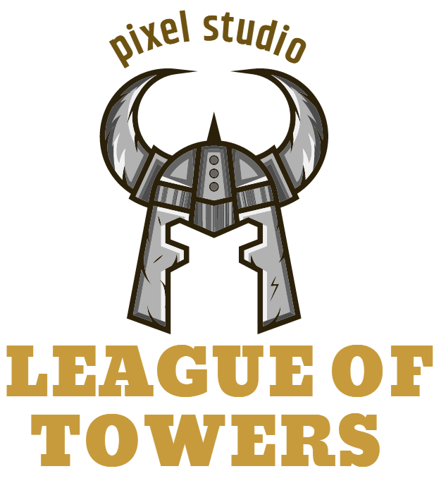

        

<h1 align="center">League of Towers</h1>
  
A web-based browser multiplayer game to interact with your friends and family virtually during COVID-19 pandemic.

  

    
      <i> (COMP-4350-A01 - Software Engineering 2 Group Project: TEAM <b>PIXEL STUDIO</b>) </i>
    
  

  
- [Team Members](#team-members)
- [Description](#description)
- [Wiki](https://github.com/Software-Engineering-2-Pixel-Studio/pixelstudio/wiki)
  * [Project Proposal](https://github.com/Software-Engineering-2-Pixel-Studio/pixelstudio/wiki/Project-Proposal)
  * [Meeting Minutes](https://github.com/Software-Engineering-2-Pixel-Studio/pixelstudio/wiki/Meeting-Minutes)
  * [Design](https://github.com/Software-Engineering-2-Pixel-Studio/pixelstudio/wiki/Design)
  * [Technologies](https://github.com/Software-Engineering-2-Pixel-Studio/pixelstudio/wiki/Technologies)
  * [Contribution Guidelines](https://github.com/Software-Engineering-2-Pixel-Studio/pixelstudio/wiki/Contribution-Guidelines)

### Team Members
| Name | GitHub Username | Role | Email
| --- | --- | --- | --- |
| Christian Hintay | [hintaycl](https://github.com/hintaycl) | Game Developer | hintaycl@myumanitoba.ca
| **Nurida Karimbaeva (Leader)** | [nuridak](https://github.com/nuridak)| Game Developer | karimban@myumanitoba.ca
| Hoang Huy Pham | [Phamhhuy](https://github.com/Phamhhuy)| Game Developer | phamhh@myumanitoba.ca

## Description
This project is a 2D tower defense game with a top-down view where players need to coordinate their actions through communication to protect the base and prevent enemy units from entering their lands. This desktop-based game will be focusing on providing people an experience of playing cooperatively by requiring them to manage shared resources such as money and experience points. At the same time, players will need to develop a reliable strategy before placing towers to defend their base since each player will be restricted to build only a specific type of tower (e. g. supporting or attacking). To coordinate their actions, players can communicate through out of game application such as Zoom or Discord.

## **Vision**
This desktop-based game will have a multiplayer feature so friends and family members could gather online and spend time together virtually during the COVID-19 pandemic.

## Objectives
The project objectives are to:
- Develop a free video game application that is playable and responsive by the end of sprint 4
- Provide a fantastic and fun tower defense gameplay and multiplayer experience that is also easily accessible by both casual players and game enthusiasts
- Connect people with a leisure activity that they can enjoy during the pandemic through the use of our built-in chat system and external communication tools like Discord
- Cultivate user groups’ teamwork capacity and skills through gameplay coordination and communication
- Deliver a demo and gain feedback from early users

## Core Features
A multiplayer game that provides a playground for everyone to connect and have fun with the community and especially with their friends. Thus, to support this purpose, our game will have these core features. Firstly, **the Co-op Mode** will be available which allows players to support each other in Gameplay. Thus, players can share the joy of fighting off enemies with their comrades. Secondly, **A leveling up system** in gameplay that allows users to make progress and receive some benefits such as tech points, powers, etc.. Lastly, our players will be able to choose their own play style or different strategies based on the situation through a **specialized class system**. For example, players can choose the support class to build towers that have ability to increase damage or the defense class to build fences that block the path until they are destroyed. At the end, with these features we hope our players can enjoy the game and have fun with friends and community.
